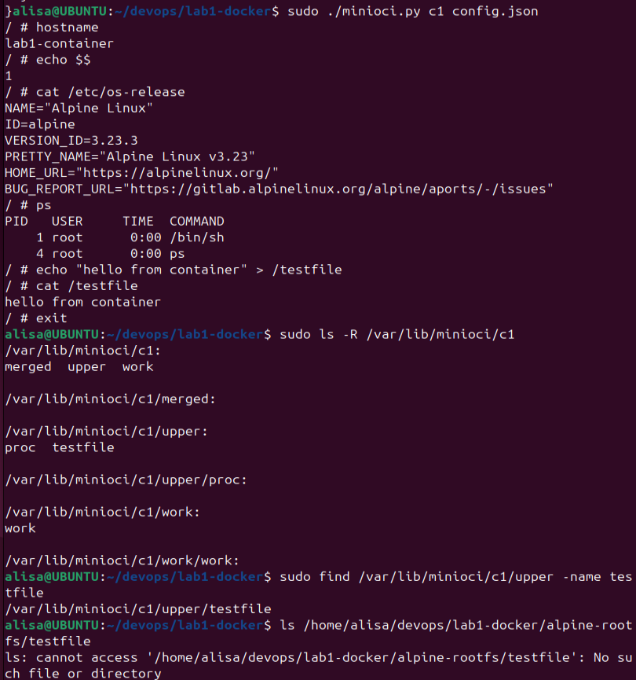

# Лабораторная работа 1: Docker (Advanced-трек)

## Ход выполнения
Перед выполнением лабораторной я подготовила среду в виртуальной машине Ubuntu: проверела наличие Python и прав sudo, создала директорию `lab1-docker`, скачала и распаковала rootfs Alpine

Дальше я создала `config.json`
```
{
  "ociVersion": "1.0.2",
  "hostname": "lab1-container",
  "root": {
    "path": "/home/alisa/devops/lab1-docker/alpine-rootfs"
  },
  "process": {
    "cwd": "/",
    "env": [
      "PATH=/bin:/sbin:/usr/bin:/usr/sbin"
    ],
    "args": ["/bin/sh"]
  }
}
```

Также я разработала утилиту ‘minioci.py’, она:
- считывает параметры из config.json
- создает директорию контейнера /var/lib/minioci/<id>
- создает каталоги upper, work, merged
- создает новые PID, Mount и UTS namespaces
- устанавливает hostname из конфигурации
- монтирует overlayfs
- выполняет chroot() в merged
- монтирует /proc внутри контейнера
- запускает указанную команду как PID=1
- ожидает завершения процесса в foreground

вот [листинг кода]([https://example.com](https://github.com/alisakorotkova/DevOps_elective/blob/main/lab1/minioci.py))


## Тестирование

Дальше я протестировала работу программы. Запустила ее командой `sudo ./minioci.py c1 config.json` и выполнила следующие проверки:
- `hostname` внутри контейнера
- PID namespace: `echo $$`
- rootfs: `cat /etc/os-release`
- /proc: `ps`
- директории контейнера: `sudo ls -R /var/lib/minioci/c1`
- overlayfs: `echo "hello from container" > /testfile` и `sudo find /var/lib/minioci/c1/upper -name testfile`



По скрину видно, что контейнер запускается корректно, `hostname` устанавливается из конфигурации, процесс внутри контейнера получает PID 1, используется Alpine rootfs, `/proc` монтируется успешно, а изменения файловой системы записываются в `upperdir`.

