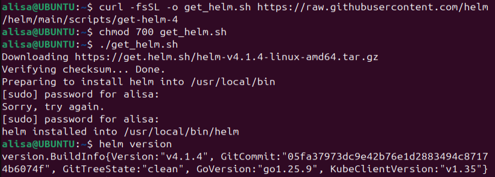
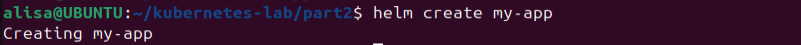
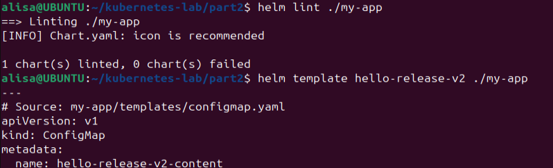
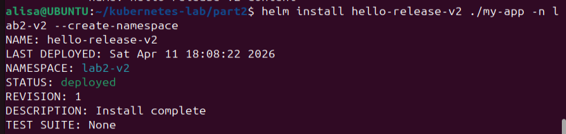
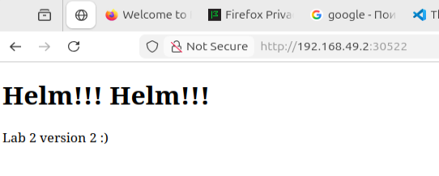
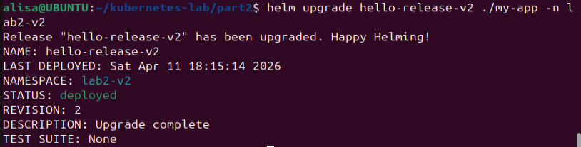
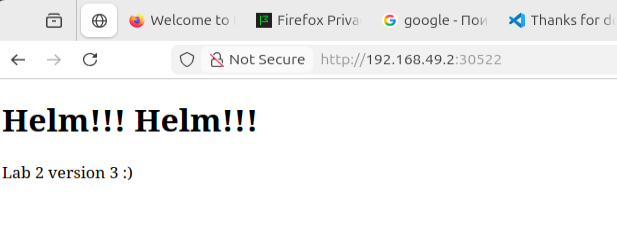

# Лабораторная работа 2: Kubernetes (базовый-трек)

## Ход выполнения

### Part 1:

Перед началом выполнения работы я установила kubectl и Minikube. Дальше я запустила кластер с помощью команды `minikube start --driver=docker`


Проверила статус, и что все готово к работе:


Дальше я создала свой маленький сервис - `app.yaml` с 3 ресурсами:

```
apiVersion: v1
kind: ConfigMap
metadata:
  name: hello-content
data:
  index.html: |
    <!DOCTYPE html>
    <html>
    <head>
      <meta charset="UTF-8">
      <title>Hello</title>
    </head>
    <body>
      <h1>Lab2 - Kubernetes</h1>
      <p>Lab2 works</p>
    </body>
    </html>
---
apiVersion: apps/v1
kind: Deployment
metadata:
  name: hello-app
spec:
  replicas: 2
  selector:
    matchLabels:
      app: hello-app
  template:
    metadata:
      labels:
        app: hello-app
    spec:
      containers:
        - name: nginx
          image: nginx:alpine
          ports:
            - containerPort: 80
          volumeMounts:
            - name: hello-html
              mountPath: /usr/share/nginx/html/index.html
              subPath: index.html
      volumes:
        - name: hello-html
          configMap:
            name: hello-content
---
apiVersion: v1
kind: Service
metadata:
  name: hello-service
spec:
  type: NodePort
  selector:
    app: hello-app
  ports:
    - port: 80
      targetPort: 80
```

- ConfigMap: для хранения неконфиденциальных данных в формате key-value; Pod может использовать его как переменные окружения, аргументы или файлы
- Deployment: управляет набором Pod’ов и обеспечивает обновления
- Service: дает стабильную точку входа к приложению, даже если Pod’ы меняются

Чтобы запустить, я использовала команду `kubectl apply -f k8s/app.yaml`


И проверила, что все запустилось, все команды дали результат:
```
kubectl get configmap
kubectl get deployments
kubectl get pods
kubectl get services
```


Также я проверила работоспособность `minikube service hello-service --url` и открыла адрес в браузере:


### Part 2:

Для второй части лабораторной, я установила Helm. С помощью `helm create my-app` создала новый chart с готовой структурой файлов.





Дальше я немного упростила структуру, удалила лишние `templates` и отредактировла код:

values.yaml
```
replicaCount: 2

image:
  repository: nginx
  tag: alpine
  pullPolicy: IfNotPresent

service:
  type: NodePort
  port: 80

content:
  title: "Helm!!! Helm!!!"
  message: "Lab 2 version 2 :)"
```

configmap.yaml
```
apiVersion: v1
kind: ConfigMap
metadata:
  name: {{ .Release.Name }}-content
data:
  index.html: |
    <!DOCTYPE html>
    <html>
    <head>
      <meta charset="UTF-8">
      <title>{{ .Values.content.title }}</title>
    </head>
    <body>
      <h1>{{ .Values.content.title }}</h1>
      <p>{{ .Values.content.message }}</p>
    </body>
    </html>
```

deployment.yaml
```
apiVersion: apps/v1
kind: Deployment
metadata:
  name: {{ .Release.Name }}-app
spec:
  replicas: {{ .Values.replicaCount }}
  selector:
    matchLabels:
      app: {{ .Release.Name }}-app
  template:
    metadata:
      labels:
        app: {{ .Release.Name }}-app
      annotations:
        checksum/config: {{ include (print $.Template.BasePath "/configmap.yaml") . | sha256sum }}
    spec:
      containers:
        - name: nginx
          image: "{{ .Values.image.repository }}:{{ .Values.image.tag }}"
          imagePullPolicy: {{ .Values.image.pullPolicy }}
          ports:
            - containerPort: 80
          volumeMounts:
            - name: html
              mountPath: /usr/share/nginx/html
              readOnly: true
      volumes:
        - name: html
          configMap:
            name: {{ .Release.Name }}-content
```

service.yaml
```
apiVersion: v1
kind: Service
metadata:
  name: {{ .Release.Name }}-service
spec:
  type: {{ .Values.service.type }}
  selector:
    app: {{ .Release.Name }}-app
  ports:
    - port: {{ .Values.service.port }}
      targetPort: 80
```
Проверила chart перед установкой `helm lint ./my-app` и `helm template hello-release-v2 ./my-app`:


Я установила chart в кластер `helm install hello-release-v2 ./my-app -n lab2-v2 --create-namespace`


И открыла адрес сервиса в браузере `minikube service hello-release-v2-service -n lab2-v2 --url:`




Дальше по заданию нужно было изменить что-то в сервисе для новой версии (я отредактировала текст). Я выполнила upgrade релиза `helm upgrade hello-release-v2 ./my-app -n lab2-v2`



И теперь на странице новый текст:



### 3 причины, почему использовать хелм удобнее чем классический деплой через кубернетес манифесты
1. Параметризация конфигурации: В Helm основные настройки выносятся в values.yaml, поэтому для изменения версии образа, числа реплик, порта или текста страницы не нужно вручную редактировать несколько .yaml файлов. Это упрощает настройку приложения и снижает вероятность ошибок.

2. Повторное использование и шаблоны: Helm позволяет один раз сделать chart с шаблонами ресурсов Kubernetes и потом использовать его для разных окружений и версий приложения.

3. Удобные обновления и откаты: Helm работает через release, поэтому приложение удобно устанавливать, обновлять и отслеживать историю изменений. Это делает процесс деплоя более управляемым.
