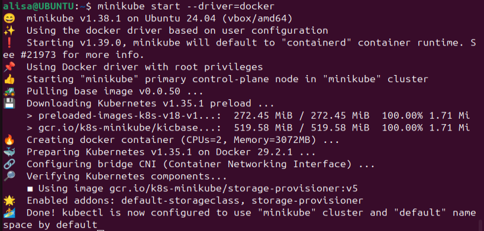
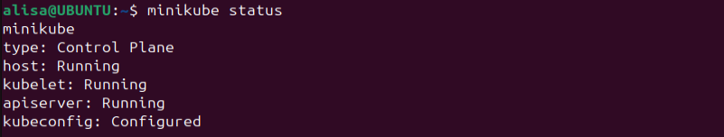
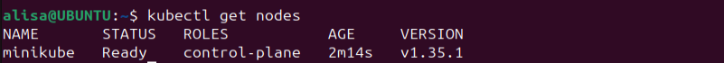
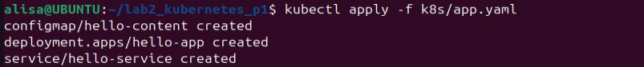
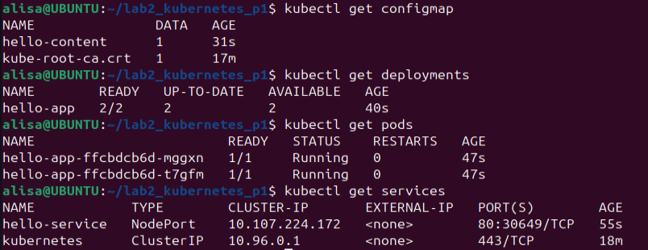
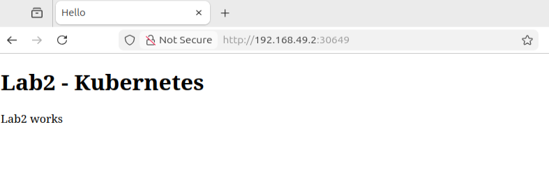

# Лабораторная работа 2: Kubernetes (базовый-трек)

## Ход выполнения

### Part 1:

Перед началом выполнения работы я установила kubectl и Minikube. Дальше я запустила кластер с помощью команды `minikube start --driver=docker`



Проверила статус, и что все готово к работе:





Дальше я создала свой маленький сервис - `app.yaml` с 3 ресурсами:

```
apiVersion: v1
kind: ConfigMap
metadata:
  name: hello-content
data:
  index.html: |
    <!DOCTYPE html>
    <html>
    <head>
      <meta charset="UTF-8">
      <title>Hello</title>
    </head>
    <body>
      <h1>Lab2 - Kubernetes</h1>
      <p>Lab2 works</p>
    </body>
    </html>
---
apiVersion: apps/v1
kind: Deployment
metadata:
  name: hello-app
spec:
  replicas: 2
  selector:
    matchLabels:
      app: hello-app
  template:
    metadata:
      labels:
        app: hello-app
    spec:
      containers:
        - name: nginx
          image: nginx:alpine
          ports:
            - containerPort: 80
          volumeMounts:
            - name: hello-html
              mountPath: /usr/share/nginx/html/index.html
              subPath: index.html
      volumes:
        - name: hello-html
          configMap:
            name: hello-content
---
apiVersion: v1
kind: Service
metadata:
  name: hello-service
spec:
  type: NodePort
  selector:
    app: hello-app
  ports:
    - port: 80
      targetPort: 80
```

- ConfigMap: для хранения неконфиденциальных данных в формате key-value; Pod может использовать его как переменные окружения, аргументы или файлы
- Deployment: управляет набором Pod’ов и обеспечивает обновления
- Service: дает стабильную точку входа к приложению, даже если Pod’ы меняются

Чтобы запустить, я использовала команду `kubectl apply -f k8s/app.yaml`



И проверила, что все запустилось, все команды дали результат:
```
kubectl get configmap
kubectl get deployments
kubectl get pods
kubectl get services
```


Также я проверила работоспособность `minikube service hello-service --url` и открыла адрес в браузере:



### Part 2:

