# Лабораторная работа 3: nginx (базовый-трек)

## Ход выполнения

### Часть 1

Для начала выполнения работы я установила nginx и mkcert, чтобы создать локальный HTTPS-сертификат:

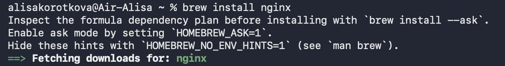
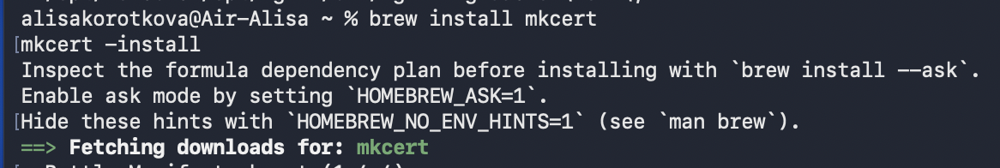


Для работы HTTPS создала локальный сертификат с помощью mkcert:
```
mkcert \
  -cert-file ~/nginx-lab/certs/lab.crt \
  -key-file ~/nginx-lab/certs/lab.key \
  project1.test project2.test
```
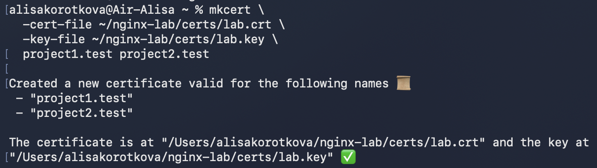

И в результате получила два файла `lab.crt` и `lab.key`.

**Далее я настроила конфиг:**

```
    #Перенаправление HTTP на HTTPS
    server {
        listen 80;
        server_name project1.test project2.test;

        return 301 https://$host$request_uri;
    }

    #Первый виртуальный хост
    server {
        listen 443 ssl;
        server_name project1.test;

        ssl_certificate     /opt/homebrew/var/www/nginx-lab/certs/lab.crt;
        ssl_certificate_key /opt/homebrew/var/www/nginx-lab/certs/lab.key;

        root /opt/homebrew/var/www/nginx-lab/project1;
        index index.html;

        location / {
            try_files $uri $uri/ =404;
        }

        # alias:
        location /shared/ {
            alias /opt/homebrew/var/www/nginx-lab/shared/;
        }
    }

    #Второй виртуальный хост
    server {
        listen 443 ssl;
        server_name project2.test;

        ssl_certificate     /opt/homebrew/var/www/nginx-lab/certs/lab.crt;
        ssl_certificate_key /opt/homebrew/var/www/nginx-lab/certs/lab.key;

        root /opt/homebrew/var/www/nginx-lab/project2;
        index index.html;

        location / {
            try_files $uri $uri/ =404;
        }

        # alias:
        location /shared/ {
            alias /opt/homebrew/var/www/nginx-lab/shared/;
        }
    }
```

**Дальше я проверила работоспособность:**

Проверка конфигурации nginx
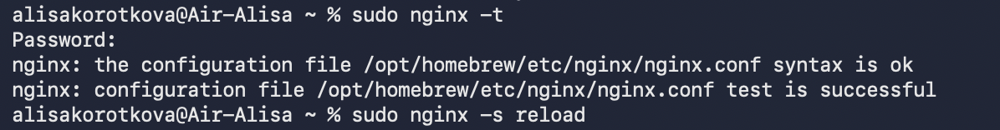

Проверка работы HTTPS
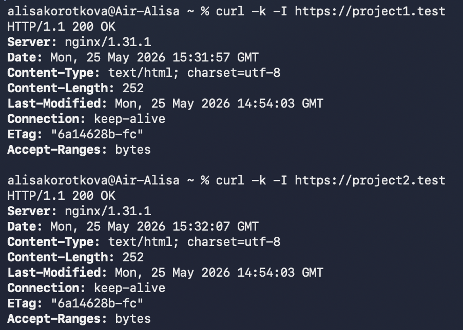

Проверка редиректа HTTP на HTTPS
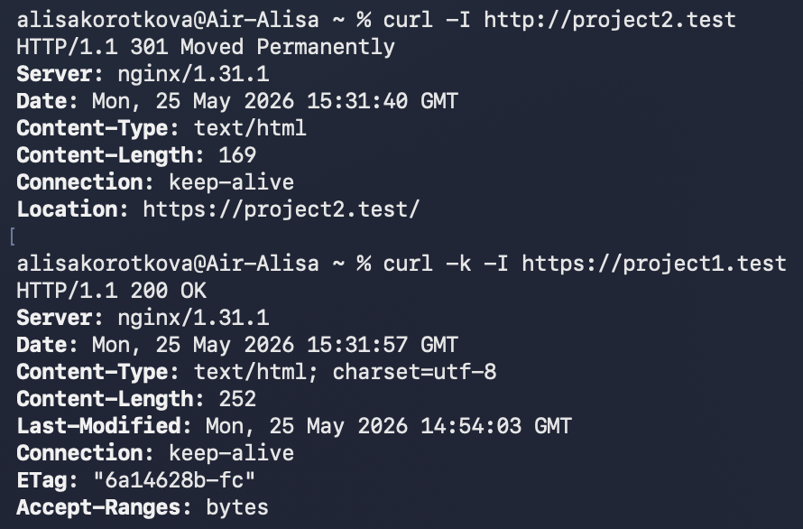

Доступ к project1 `http://project1.test`
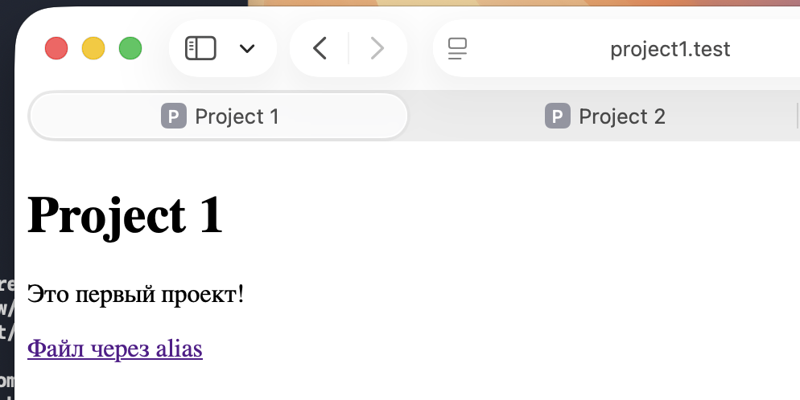

Доступ к project2 `http://project2.test`
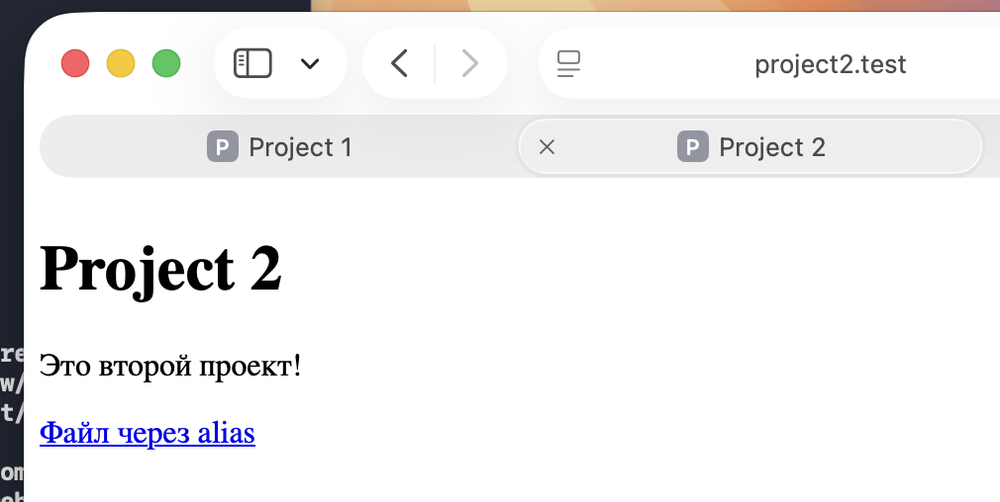

Проверка alias `https://project1.test/shared/info.txt`
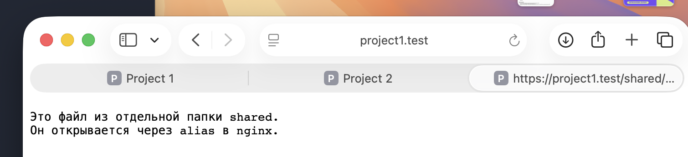

Таким образом, nginx был настроен по тз: он работает по HTTPS, перенаправляет HTTP на HTTPS, обслуживает несколько доменных имен и использует alias для переопределения путей к файлам.

### Часть 2

Для проверки я выбрала сайт: https://ichinatrip.ru/city-guide/shanghai.htm . Я выбрала этот сайт, потому что он не является крупным сервисом вроде Google или Яндекса, а также у него простой URL и по заголовкам видно, что сервер использует nginx.

**1. Первичная проверка сайта**

Сначала я проверила, доступен ли сайт и какой сервер отвечает на запрос: `curl -I https://ichinatrip.ru/city-guide/shanghai.htm`

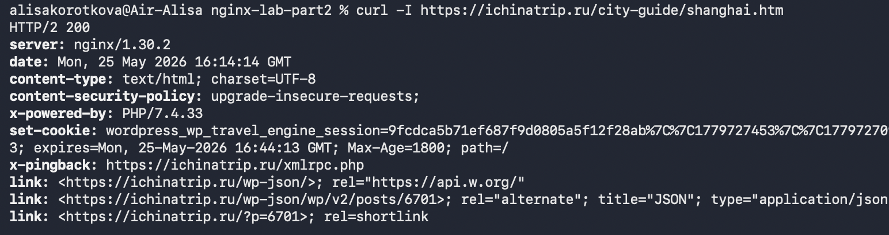

Сервер вернул HTTP/2 200, что означает успешную доступность страницы. В заголовке Server указано nginx/1.30.2, значит сайт обслуживается nginx. Также были обнаружены признаки WordPress и заголовок X-Powered-By: PHP/7.4.33. Это можно считать информационным раскрытием версии PHP, но само по себе это не дает доступа к закрытым данным.

**2. Проверка path traversal**

Я выполнила несколько проверок: проверялись URL с последовательностями ../../../../etc/passwd, URL-кодированными вариантами %2e%2e и вариантом из вложенной директории /city-guide/. 

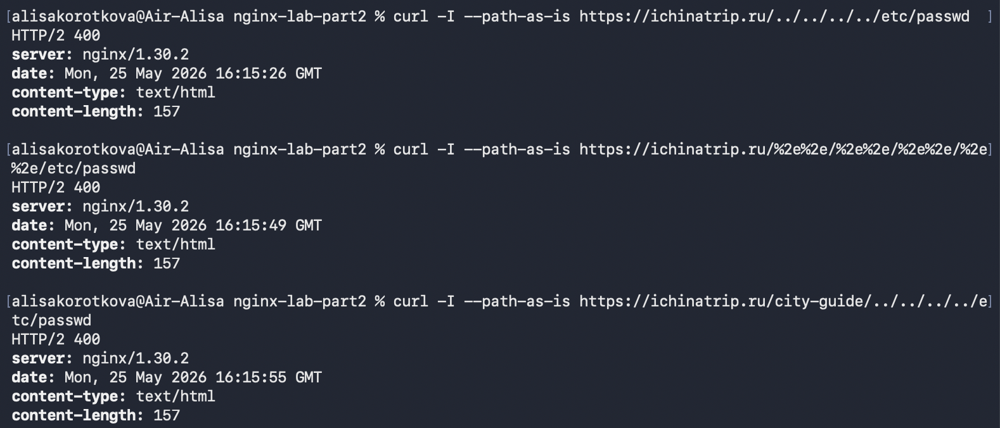

Во всех случаях сервер вернул HTTP/2 400 Bad Request, те запросы были отклонены, доступ к системным файлам получить не удалось. Уязвимость path traversal не подтверждена.

**3. Проверка directory listing**

Я проверила типовые директории /images/, /img/, /upload/, /files/.

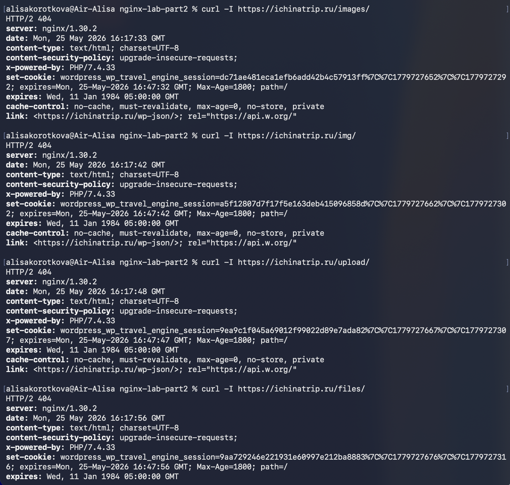

Во всех случаях сервер вернул HTTP/2 404 Not Found. Список файлов в директориях не отображался, значит directory listing для проверенных путей не обнаружен.

**4. Перебор страниц через ffuf**

Также я выполнила проверку с помощью инструмента ffuf. Использовался небольшой словарь из 75 слов, составленный под тематику сайта и типовые служебные пути. Запуск выполнялся в безопасном режиме: один поток, один запрос в секунду. 

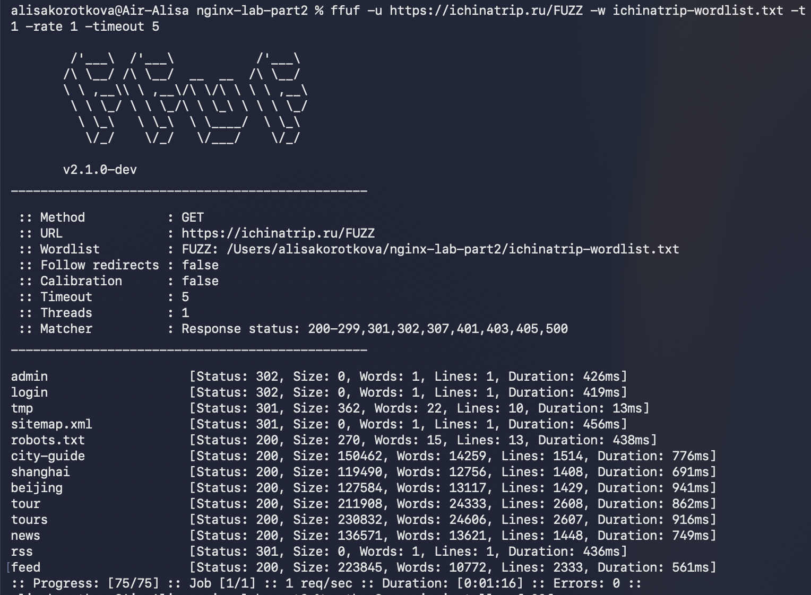

В результате были найдены существующие публичные страницы и служебные пути, например /robots.txt, /city-guide, /shanghai, /beijing, /tour, /tours, /news, /feed. Также пути /admin и /login вернули 302 Redirect. Доступа к закрытым данным получить не удалось.

**Итог:** успешный взлом не выполнен. Проверенные уязвимости path traversal и directory listing не подтвердились. Перебор через ffuf позволил найти только публично доступные страницы и редиректы.


