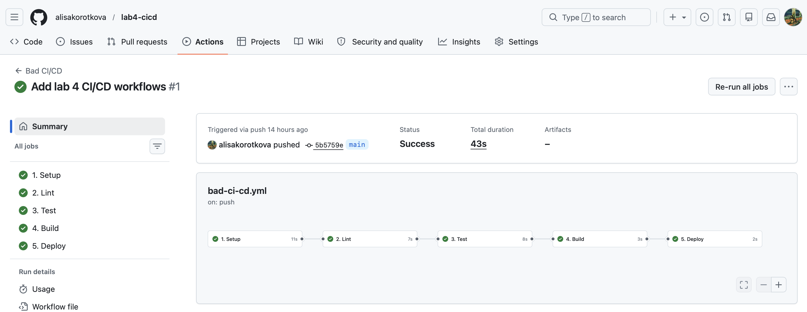
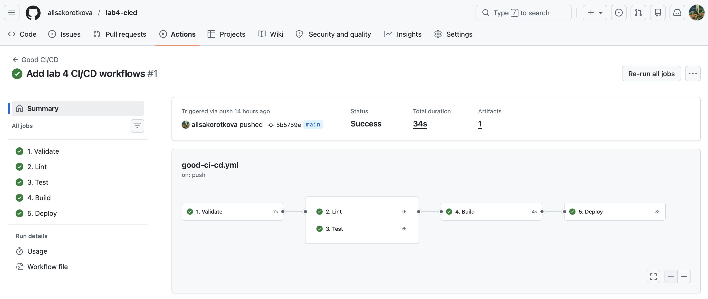

# Лабораторная работа 4 (базовый-трек)

## Часть 1

**Bad CI/CD**

1. Setup
2. Lint
3. Test
4. Build
5. Deploy

```
name: Bad CI/CD

on:
  push:
  pull_request:

env:
  API_KEY: "hardcoded-secret-key-12345"
  SERVER_PASSWORD: "prod_password"

jobs:
  setup:
    name: 1. Setup
    runs-on: ubuntu-latest

    steps:
      - name: Checkout repository
        uses: actions/checkout@v4

      - name: Setup floating Python version
        uses: actions/setup-python@v5
        with:
          python-version: "3.x"

      - name: Install tools without fixed versions
        run: |
          pip install --upgrade pip
          pip install pytest flake8

  lint:
    name: 2. Lint
    runs-on: ubuntu-latest
    needs: setup
    continue-on-error: true

    steps:
      - name: Checkout repository
        uses: actions/checkout@v4

      - name: Setup floating Python version
        uses: actions/setup-python@v5
        with:
          python-version: "3.x"

      - name: Install flake8 without fixed version
        run: pip install flake8

      - name: Run lint and ignore errors
        run: flake8 app.py tests || true

  test:
    name: 3. Test
    runs-on: ubuntu-latest
    needs: lint
    continue-on-error: true

    steps:
      - name: Checkout repository
        uses: actions/checkout@v4

      - name: Setup floating Python version
        uses: actions/setup-python@v5
        with:
          python-version: "3.x"

      - name: Install pytest without fixed version
        run: pip install pytest

      - name: Run tests and ignore errors
        run: pytest || true

  build:
    name: 4. Build
    runs-on: ubuntu-latest
    needs: test

    steps:
      - name: Checkout repository
        uses: actions/checkout@v4

      - name: Build archive
        run: |
          mkdir -p dist
          tar -czf dist/app.tar.gz app.py tests requirements.txt

  deploy:
    name: 5. Deploy
    runs-on: ubuntu-latest
    needs: build

    steps:
      - name: Fake deploy from any branch or pull request
        run: |
          echo "Deploy started"
          echo "Using API_KEY=$API_KEY"
          echo "Using SERVER_PASSWORD=$SERVER_PASSWORD"
          echo "Deploy finished"

```

**Good CI/CD**

1. Validate
2. Lint
3. Test
4. Build
5. Deploy

```
name: Good CI/CD

on:
  push:
    branches:
      - main
  pull_request:
    branches:
      - main

jobs:
  validate:
    name: 1. Validate
    runs-on: ubuntu-24.04

    steps:
      - name: Checkout repository
        uses: actions/checkout@v4

      - name: Setup fixed Python version
        uses: actions/setup-python@v5
        with:
          python-version: "3.12"

      - name: Validate Python syntax
        run: python -m py_compile app.py

  lint:
    name: 2. Lint
    runs-on: ubuntu-24.04
    needs: validate

    steps:
      - name: Checkout repository
        uses: actions/checkout@v4

      - name: Setup fixed Python version
        uses: actions/setup-python@v5
        with:
          python-version: "3.12"

      - name: Install dependencies from requirements.txt
        run: python -m pip install -r requirements.txt

      - name: Run lint
        run: flake8 app.py tests

  test:
    name: 3. Test
    runs-on: ubuntu-24.04
    needs: validate

    steps:
      - name: Checkout repository
        uses: actions/checkout@v4

      - name: Setup fixed Python version
        uses: actions/setup-python@v5
        with:
          python-version: "3.12"

      - name: Install dependencies from requirements.txt
        run: python -m pip install -r requirements.txt

      - name: Run tests
        run: pytest

  build:
    name: 4. Build
    runs-on: ubuntu-24.04
    needs:
      - lint
      - test

    steps:
      - name: Checkout repository
        uses: actions/checkout@v4

      - name: Build archive
        run: |
          mkdir -p dist
          tar -czf dist/app.tar.gz app.py tests requirements.txt README.md

      - name: Upload build artifact
        uses: actions/upload-artifact@v4
        with:
          name: app-build
          path: dist/app.tar.gz

  deploy:
    name: 5. Deploy
    runs-on: ubuntu-24.04
    needs: build
    if: github.ref == 'refs/heads/main' && github.event_name == 'push'

    env:
      API_KEY: ${{ secrets.DEPLOY_API_KEY }}
      SERVER_PASSWORD: ${{ secrets.SERVER_PASSWORD }}

    steps:
      - name: Download build artifact
        uses: actions/download-artifact@v4
        with:
          name: app-build
          path: dist

      - name: Safe fake deploy
        run: |
          echo "Deploy started"

          if [ -z "$API_KEY" ]; then
            echo "DEPLOY_API_KEY is not configured"
          else
            echo "DEPLOY_API_KEY is configured"
          fi

          if [ -z "$SERVER_PASSWORD" ]; then
            echo "SERVER_PASSWORD is not configured"
          else
            echo "SERVER_PASSWORD is configured"
          fi

          echo "Artifact:"
          ls -la dist

          echo "Deploy finished"
```
### Роботоспособность:





### Плохие практики и исправления:
#### БЭД practice 1 - secrets

```yaml
env:
  API_KEY: "hardcoded-secret-key-12345"
  SERVER_PASSWORD: "prod_password"
```

**Почему плохо:**
- секретные ключи и пароли хранятся прямо в CI/CD файле
- любой, кто имеет доступ к репозиторию, может их увидеть
- при изменении секрета нужно менять код в репозитории
- это небезопасно

**ГУД файл:**

```yaml
env:
  API_KEY: ${{ secrets.DEPLOY_API_KEY }}
  SERVER_PASSWORD: ${{ secrets.SERVER_PASSWORD }}
```

**Влияние:**
- секреты хранятся в настройках GitHub и не записаны напрямую в репозитории
- секреты доступны только во время выполнения pipeline
- можно изменить секреты без изменения кода
- повышается безопасность


#### БЭД practice 2 - floating versions

```yaml
runs-on: ubuntu-latest

with:
  python-version: "3.x"
```

**Почему плохо:**
- `ubuntu-latest` может со временем начать указывать на другую версию Ubuntu
- `python-version: "3.x"` может выбрать новую версию Python
- pipeline может неожиданно сломаться после обновления окружения
- результат сборки становится менее предсказуемым

**ГУД файл:**

```yaml
runs-on: ubuntu-24.04

with:
  python-version: "3.12"
```

**Влияние:**
- используется конкретная версия Ubuntu и Python
- pipeline становится стабильнее
- результат выполнения легче повторить


#### БЭД practice 3 - unpinned dependencies

```bash
pip install pytest flake8
```

**Почему плохо:**
- устанавливаются последние доступные версии библиотек
- новая версия библиотеки может сломать pipeline
- сложно понять, с какими версиями проект точно работал

**ГУД файл:**

```bash
python -m pip install -r requirements.txt
```

Файл `requirements.txt`:

```text
pytest==8.3.4
flake8==7.1.1
```

**Влияние:**
- зависимости зафиксированы
- pipeline становится более предсказуемым
- проще воспроизвести сборку локально и на GitHub
- меньше риск случайной поломки из-за обновления библиотек


#### БЭД practice 4 - ignoring errors

```yaml
continue-on-error: true
```

```bash
flake8 app.py tests || true
pytest || true
```

**Почему плохо:**
- pipeline может быть зеленым, даже если есть ошибки
- ошибки линтера игнорируются
- ошибки тестов игнорируются
- можно случайно отправить нерабочий код дальше в build или deploy

**ГУД файл:**

```bash
flake8 app.py tests
pytest
```

**Влияние:**
- если линтер находит ошибку, pipeline падает
- если тесты не проходят, pipeline падает
- некачественный код не проходит дальше


#### БЭД practice 5 - deploy from any branch or pull request

```yaml
on:
  push:
  pull_request:
```

```yaml
deploy:
  name: 5. Deploy
  runs-on: ubuntu-latest
  needs: build
```

**Почему плохо:**
- deploy запускается после push в любую ветку
- deploy запускается даже для pull request
- можно случайно выполнить deploy из тестовой ветки
- нет контроля, откуда разрешен deploy

**ГУД файл:**

```yaml
on:
  push:
    branches:
      - main
  pull_request:
    branches:
      - main
```

```yaml
if: github.ref == 'refs/heads/main' && github.event_name == 'push'
```

**Влияние:**
- deploy запускается только при push в ветку `main`
- pull request может пройти проверки, но не запускает deploy
- снижается риск случайного deploy
- процесс становится безопаснее и контролируемее


## Часть 2
