# Лабораторная работа 4 (базовый-трек)

## Часть 1

**Bad CI/CD**

1. Setup
2. Lint
3. Test
4. Build
5. Deploy

```
name: Bad CI/CD

on:
  push:
  pull_request:

env:
  API_KEY: "hardcoded-secret-key-12345"
  SERVER_PASSWORD: "prod_password"

jobs:
  setup:
    name: 1. Setup
    runs-on: ubuntu-latest

    steps:
      - name: Checkout repository
        uses: actions/checkout@v4

      - name: Setup floating Python version
        uses: actions/setup-python@v5
        with:
          python-version: "3.x"

      - name: Install tools without fixed versions
        run: |
          pip install --upgrade pip
          pip install pytest flake8

  lint:
    name: 2. Lint
    runs-on: ubuntu-latest
    needs: setup
    continue-on-error: true

    steps:
      - name: Checkout repository
        uses: actions/checkout@v4

      - name: Setup floating Python version
        uses: actions/setup-python@v5
        with:
          python-version: "3.x"

      - name: Install flake8 without fixed version
        run: pip install flake8

      - name: Run lint and ignore errors
        run: flake8 app.py tests || true

  test:
    name: 3. Test
    runs-on: ubuntu-latest
    needs: lint
    continue-on-error: true

    steps:
      - name: Checkout repository
        uses: actions/checkout@v4

      - name: Setup floating Python version
        uses: actions/setup-python@v5
        with:
          python-version: "3.x"

      - name: Install pytest without fixed version
        run: pip install pytest

      - name: Run tests and ignore errors
        run: pytest || true

  build:
    name: 4. Build
    runs-on: ubuntu-latest
    needs: test

    steps:
      - name: Checkout repository
        uses: actions/checkout@v4

      - name: Build archive
        run: |
          mkdir -p dist
          tar -czf dist/app.tar.gz app.py tests requirements.txt

  deploy:
    name: 5. Deploy
    runs-on: ubuntu-latest
    needs: build

    steps:
      - name: Fake deploy from any branch or pull request
        run: |
          echo "Deploy started"
          echo "Using API_KEY=$API_KEY"
          echo "Using SERVER_PASSWORD=$SERVER_PASSWORD"
          echo "Deploy finished"

```

**Good CI/CD**

1. Validate
2. Lint
3. Test
4. Build
5. Deploy

```
name: Good CI/CD

on:
  push:
    branches:
      - main
  pull_request:
    branches:
      - main

jobs:
  validate:
    name: 1. Validate
    runs-on: ubuntu-24.04

    steps:
      - name: Checkout repository
        uses: actions/checkout@v4

      - name: Setup fixed Python version
        uses: actions/setup-python@v5
        with:
          python-version: "3.12"

      - name: Validate Python syntax
        run: python -m py_compile app.py

  lint:
    name: 2. Lint
    runs-on: ubuntu-24.04
    needs: validate

    steps:
      - name: Checkout repository
        uses: actions/checkout@v4

      - name: Setup fixed Python version
        uses: actions/setup-python@v5
        with:
          python-version: "3.12"

      - name: Install dependencies from requirements.txt
        run: python -m pip install -r requirements.txt

      - name: Run lint
        run: flake8 app.py tests

  test:
    name: 3. Test
    runs-on: ubuntu-24.04
    needs: validate

    steps:
      - name: Checkout repository
        uses: actions/checkout@v4

      - name: Setup fixed Python version
        uses: actions/setup-python@v5
        with:
          python-version: "3.12"

      - name: Install dependencies from requirements.txt
        run: python -m pip install -r requirements.txt

      - name: Run tests
        run: pytest

  build:
    name: 4. Build
    runs-on: ubuntu-24.04
    needs:
      - lint
      - test

    steps:
      - name: Checkout repository
        uses: actions/checkout@v4

      - name: Build archive
        run: |
          mkdir -p dist
          tar -czf dist/app.tar.gz app.py tests requirements.txt README.md

      - name: Upload build artifact
        uses: actions/upload-artifact@v4
        with:
          name: app-build
          path: dist/app.tar.gz

  deploy:
    name: 5. Deploy
    runs-on: ubuntu-24.04
    needs: build
    if: github.ref == 'refs/heads/main' && github.event_name == 'push'

    env:
      API_KEY: ${{ secrets.DEPLOY_API_KEY }}
      SERVER_PASSWORD: ${{ secrets.SERVER_PASSWORD }}

    steps:
      - name: Download build artifact
        uses: actions/download-artifact@v4
        with:
          name: app-build
          path: dist

      - name: Safe fake deploy
        run: |
          echo "Deploy started"

          if [ -z "$API_KEY" ]; then
            echo "DEPLOY_API_KEY is not configured"
          else
            echo "DEPLOY_API_KEY is configured"
          fi

          if [ -z "$SERVER_PASSWORD" ]; then
            echo "SERVER_PASSWORD is not configured"
          else
            echo "SERVER_PASSWORD is configured"
          fi

          echo "Artifact:"
          ls -la dist

          echo "Deploy finished"
```
### Роботоспособность:


### Плохие практики и исправления:
#### БЭД practice 1 - secrets

```yaml
env:
  API_KEY: "hardcoded-secret-key-12345"
  SERVER_PASSWORD: "prod_password"
```

**Почему плохо:**
- секретные ключи и пароли хранятся прямо в CI/CD файле
- любой, кто имеет доступ к репозиторию, может их увидеть
- при изменении секрета нужно менять код в репозитории
- это небезопасно

**ГУД файл:**

```yaml
env:
  API_KEY: ${{ secrets.DEPLOY_API_KEY }}
  SERVER_PASSWORD: ${{ secrets.SERVER_PASSWORD }}
```

**Влияние:**
- секреты хранятся в настройках GitHub и не записаны напрямую в репозитории
- секреты доступны только во время выполнения pipeline
- можно изменить секреты без изменения кода
- повышается безопасность


#### БЭД practice 2 - floating versions

```yaml
runs-on: ubuntu-latest

with:
  python-version: "3.x"
```

**Почему плохо:**
- `ubuntu-latest` может со временем начать указывать на другую версию Ubuntu
- `python-version: "3.x"` может выбрать новую версию Python
- pipeline может неожиданно сломаться после обновления окружения
- результат сборки становится менее предсказуемым

**ГУД файл:**

```yaml
runs-on: ubuntu-24.04

with:
  python-version: "3.12"
```

**Влияние:**
- используется конкретная версия Ubuntu и Python
- pipeline становится стабильнее
- результат выполнения легче повторить


#### БЭД practice 3 - unpinned dependencies

```bash
pip install pytest flake8
```

**Почему плохо:**
- устанавливаются последние доступные версии библиотек
- новая версия библиотеки может сломать pipeline
- сложно понять, с какими версиями проект точно работал

**ГУД файл:**

```bash
python -m pip install -r requirements.txt
```

Файл `requirements.txt`:

```text
pytest==8.3.4
flake8==7.1.1
```

**Влияние:**
- зависимости зафиксированы
- pipeline становится более предсказуемым
- проще воспроизвести сборку локально и на GitHub
- меньше риск случайной поломки из-за обновления библиотек


#### БЭД practice 4 - ignoring errors

```yaml
continue-on-error: true
```

```bash
flake8 app.py tests || true
pytest || true
```

**Почему плохо:**
- pipeline может быть зеленым, даже если есть ошибки
- ошибки линтера игнорируются
- ошибки тестов игнорируются
- можно случайно отправить нерабочий код дальше в build или deploy

**ГУД файл:**

```bash
flake8 app.py tests
pytest
```

**Влияние:**
- если линтер находит ошибку, pipeline падает
- если тесты не проходят, pipeline падает
- некачественный код не проходит дальше


#### БЭД practice 5 - deploy from any branch or pull request

```yaml
on:
  push:
  pull_request:
```

```yaml
deploy:
  name: 5. Deploy
  runs-on: ubuntu-latest
  needs: build
```

**Почему плохо:**
- deploy запускается после push в любую ветку
- deploy запускается даже для pull request
- можно случайно выполнить deploy из тестовой ветки
- нет контроля, откуда разрешен deploy

**ГУД файл:**

```yaml
on:
  push:
    branches:
      - main
  pull_request:
    branches:
      - main
```

```yaml
if: github.ref == 'refs/heads/main' && github.event_name == 'push'
```

**Влияние:**
- deploy запускается только при push в ветку `main`
- pull request может пройти проверки, но не запускает deploy
- снижается риск случайного deploy
- процесс становится безопаснее и контролируемее


## Часть 2


Сначала я установила minikube и запустила локальный Kubernetes-кластер:

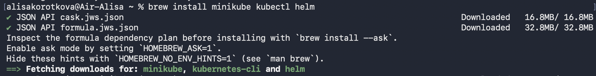

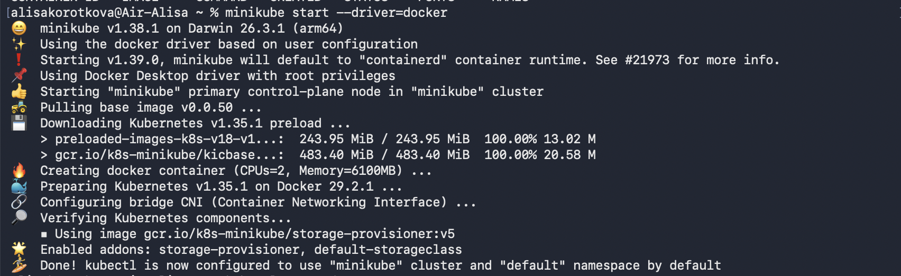

После этого я установила HashiCorp Vault в namespace `vault`:

```bash
helm install vault . \
  --namespace vault \
  --create-namespace \
  --set "server.dev.enabled=true" \
  --set "server.dev.devRootToken=root"
```

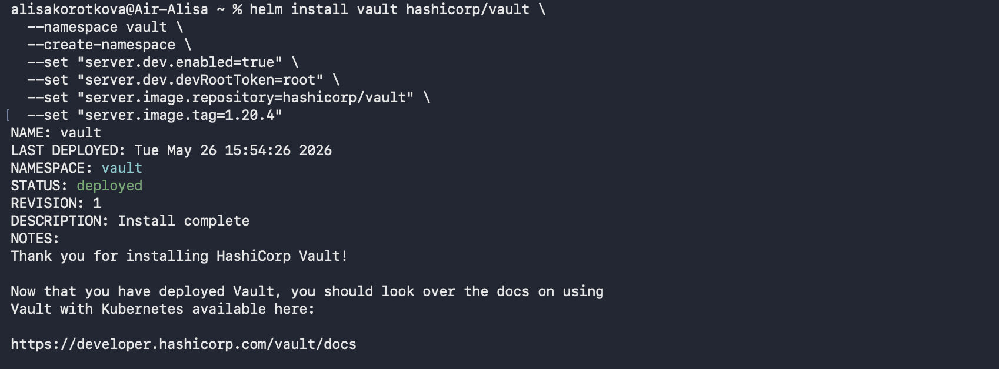
 
Я использовала dev-режим, потому что он проще для локальной демонстрации. Потом я проверила, что pod Vault запустился:

```bash
kubectl get pods -n vault
```

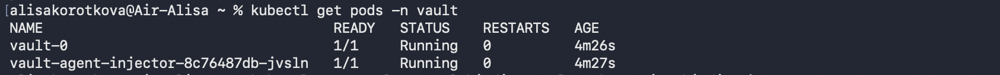


Чтобы Vault мог проверять Kubernetes ServiceAccount токены, я добавила clusterrolebinding (Vault теперь имеет право проверять ServiceAccount токены через Kubernetes TokenReview API):

```bash
kubectl create clusterrolebinding vault-tokenreview-binding \
  --clusterrole=system:auth-delegator \
  --serviceaccount=vault:vault \
  --dry-run=client -o yaml | kubectl apply -f -
```
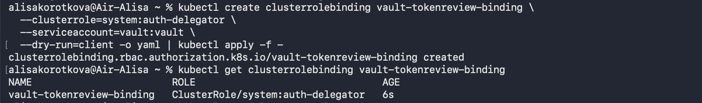


Дальше я включила Kubernetes Auth method в Vault, чтобы он смог проверять, какой ServiceAccount обращается за секретом:

```bash
kubectl -n vault exec vault-0 -- sh -c '
export VAULT_ADDR=http://127.0.0.1:8200
export VAULT_TOKEN=root

vault auth enable kubernetes || true

vault write auth/kubernetes/config \
  token_reviewer_jwt="$(cat /var/run/secrets/kubernetes.io/serviceaccount/token)" \
  kubernetes_host="https://kubernetes.default.svc:443" \
  kubernetes_ca_cert=@/var/run/secrets/kubernetes.io/serviceaccount/ca.crt
'
```

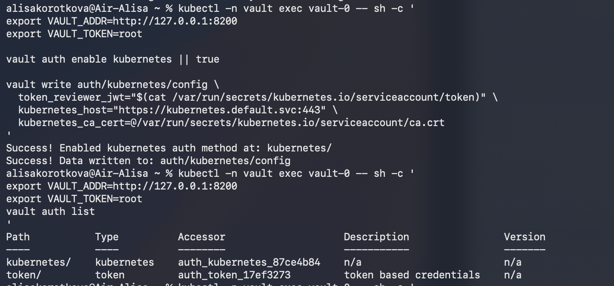


Я добавила секрет в Vault:

```bash
kubectl -n vault exec vault-0 -- sh -c '
export VAULT_ADDR=http://127.0.0.1:8200
export VAULT_TOKEN=root

vault kv put secret/lab4 \
  API_KEY="vault-api-key-12345" \
  SERVER_PASSWORD="vault-password-12345"
'
```

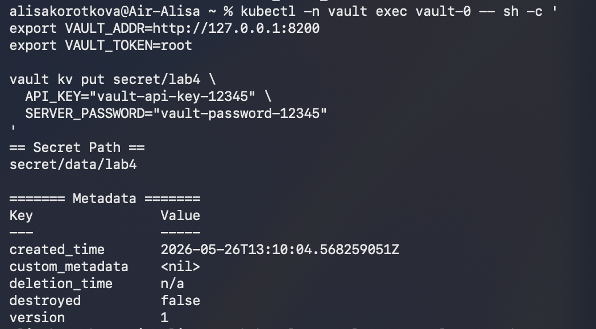


Затем я создала ServiceAccount для сервиса, который будет обращаться к Vault:

```bash
kubectl create serviceaccount lab4-vault-reader \
  --dry-run=client -o yaml | kubectl apply -f -
```

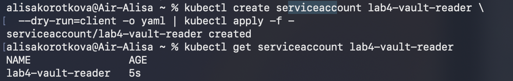


После этого я создала Vault policy:

```bash
kubectl -n vault exec -i vault-0 -- sh <<'EOF'
export VAULT_ADDR=http://127.0.0.1:8200
export VAULT_TOKEN=root

vault policy write lab4-policy - <<POLICY
path "secret/data/lab4" {
  capabilities = ["read"]
}
POLICY
EOF
```

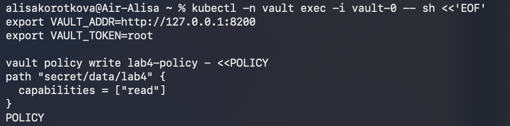


То есть у сервиса нет полного доступ ко всем секретам. Эта policy разрешает только чтение секрета по пути:

```text
secret/data/lab4
```

Дальше я создала Vault role:

```bash
kubectl -n vault exec vault-0 -- sh -c '
export VAULT_ADDR=http://127.0.0.1:8200
export VAULT_TOKEN=root

vault write auth/kubernetes/role/lab4-role \
  bound_service_account_names=lab4-vault-reader \
  bound_service_account_namespaces=default \
  policies=lab4-policy \
  ttl=1h
'
```

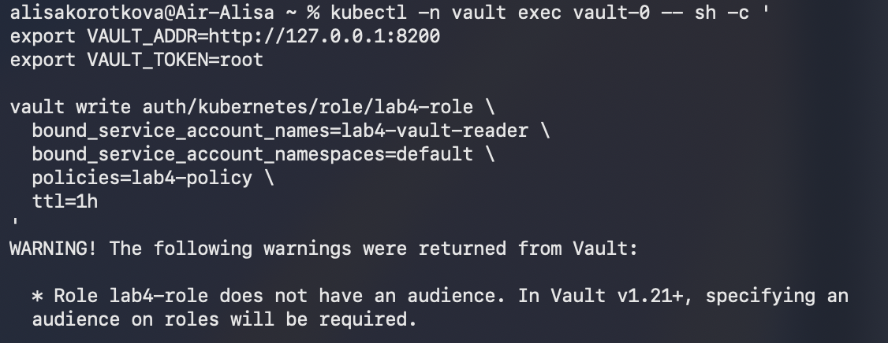


Эта команда связала между собой:

- Kubernetes ServiceAccount `lab4-vault-reader`
- Vault policy `lab4-policy`
- Vault role `lab4-role`

Теперь сервис с этим ServiceAccount может получить временный Vault token и прочитать только разрешенный секрет.


Я создала файл `vault-secret-reader-job.yaml`:

```
apiVersion: batch/v1
kind: Job
metadata:
  name: vault-secret-reader
spec:
  backoffLimit: 0
  template:
    spec:
      serviceAccountName: lab4-vault-reader
      restartPolicy: Never
      containers:
        - name: reader
          image: hashicorp/vault:1.20.4
          env:
            - name: VAULT_ADDR
              value: "http://vault.vault.svc.cluster.local:8200"
          command: ["/bin/sh", "-c"]
          args:
            - |
              set -e

              echo "Starting service..."
              echo "Trying to authenticate in Vault using Kubernetes ServiceAccount..."

              JWT="$(cat /var/run/secrets/kubernetes.io/serviceaccount/token)"

              VAULT_TOKEN="$(vault write -field=token auth/kubernetes/login role=lab4-role jwt="$JWT")"

              echo "Authentication successful"
              echo "Trying to read secret from Vault..."

              API_KEY="$(VAULT_TOKEN="$VAULT_TOKEN" vault kv get -field=API_KEY secret/lab4)"
              SERVER_PASSWORD="$(VAULT_TOKEN="$VAULT_TOKEN" vault kv get -field=SERVER_PASSWORD secret/lab4)"

              if [ -n "$API_KEY" ] && [ -n "$SERVER_PASSWORD" ]; then
                echo "Secret was successfully received from Vault"
                echo "API_KEY length: ${#API_KEY}"
                echo "SERVER_PASSWORD length: ${#SERVER_PASSWORD}"
                echo "Secret values are not printed to logs"
              else
                echo "Secret was not received"
                exit 1
              fi

              echo "Service finished successfully"
```

`vault-secret-reader` Job:
1. запускается с ServiceAccount `lab4-vault-reader`
2. авторизуется в Vault через Kubernetes Auth
3. получает секрет из Vault
4. проверяет, что секрет был получен
5. не выводит значение секрета в логи

И потом запустила Job:

```bash
kubectl apply -f part2-vault/vault-secret-reader-job.yaml
```


Я проверила логи Job:

```bash
kubectl logs job/vault-secret-reader
```

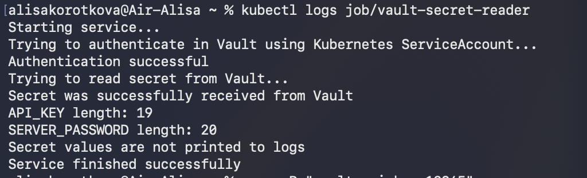


В логах было видно, что сервис успешно авторизовался в Vault и получил секрет. При этом сами значения секретов в логах не отображались.

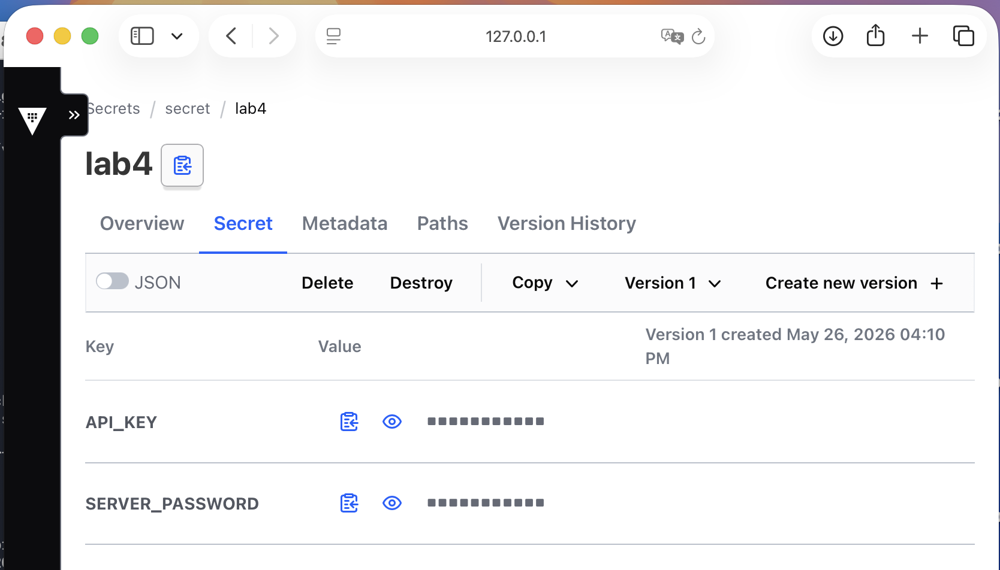


Для второй части я также добавила отдельный GitHub Actions workflow, и там выполняются такие проверки:
1. файл `vault-secret-reader-job.yaml` существует
2. в файле нет захардкоженных секретов
3. используется `VAULT_ADDR`
4. используется Kubernetes ServiceAccount `lab4-vault-reader`
5. используется Vault role `lab4-role`

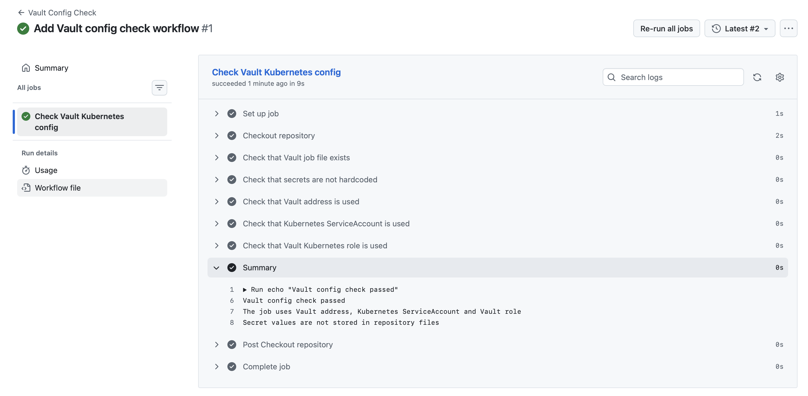


## Почему такой способ является хорошей практикой

Я считаю этот способ более безопасным и красивым, потому что:

- секреты хранятся централизованно в отдельном secret manager
- приложение получает доступ только к нужному секрету
- доступ ограничен через Vault policy
- используется Kubernetes ServiceAccount, а не хардкод токен
- Vault выдает временный токен с ограниченным временем жизни
- секреты не лежат в YAML-файлах проекта
- секреты не отображаются в логах


## Почему хранение секретов в CI/CD переменных репозитория не всегда является хорошей практикой

Хранение секретов в CI/CD переменных репозитория лучше, чем хранение секретов прямо в коде, но это не является хорошей практикой.

Минусы такого подхода:
- секреты привязаны к конкретному репозиторию
- если проектов много, секретами сложнее централизованно управлять
- сложнее контролировать, какой сервис к какому секрету имеет доступ
- секреты часто доступны всему pipeline, хотя нужны только одному шагу
- нет такой гибкой системы policy, как в Vault
- сложнее организовать временные токены с коротким сроком жизни

