# Лабораторная работа №5  

## Обычная часть

Я настроила мониторинг сервиса, запущенного в Kubernetes, с помощью Prometheus и Grafana. Для этого:

Для локального Kubernetes-кластера я использовала `minikube`:

Дальше я установила Prometheus и Grafana:

```bash
helm repo add prometheus-community https://prometheus-community.github.io/helm-charts
helm repo update

helm install monitoring prometheus-community/kube-prometheus-stack \
  --namespace monitoring \
  --create-namespace \
  --set grafana.adminPassword=admin123 \
  --set prometheus.prometheusSpec.serviceMonitorSelectorNilUsesHelmValues=false
```

После установки я проверила pod’ы мониторинга:

```bash
kubectl get pods -n monitoring
```

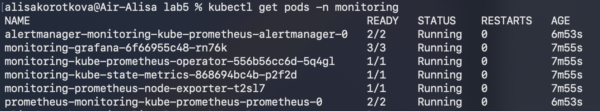

Prometheus, Grafana и Alertmanager успешно запустились.

Я создала namespace `kubectl create namespace lab5`

Затем развернула тестовый сервис `podinfo`, который предоставляет endpoint `/metrics`.

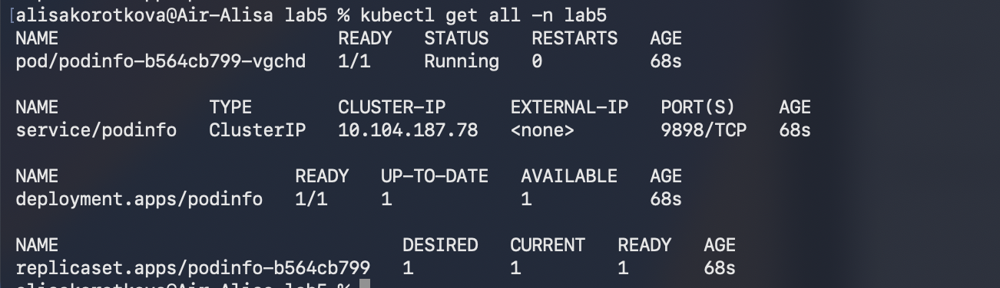

Для проверки работы сервиса я использовала port-forward:

```bash
kubectl port-forward -n lab5 svc/podinfo 9898:9898
```

После этого я открыла в браузере:

```text
http://localhost:9898
```

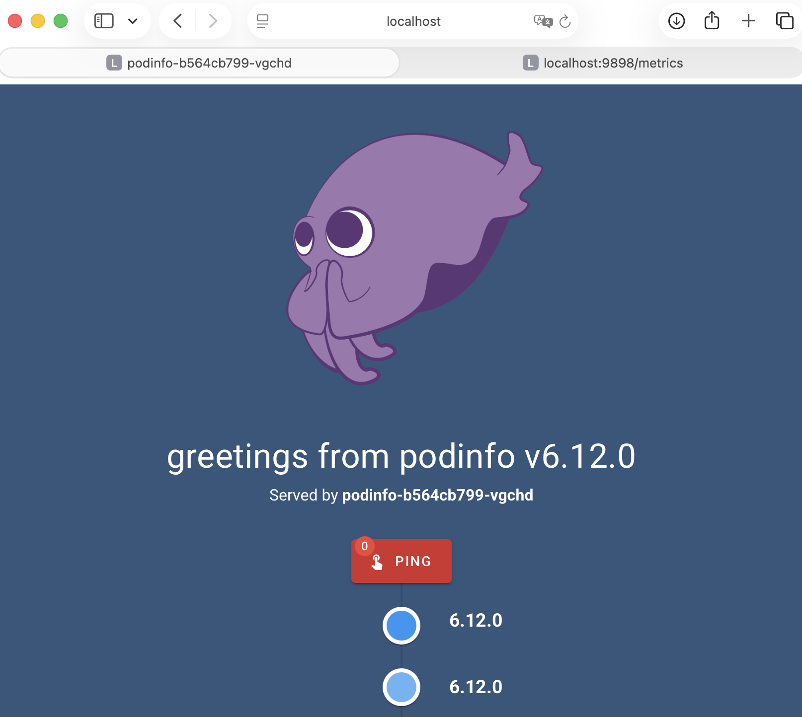

Также я проверила endpoint с метриками:

```text
http://localhost:9898/metrics
```

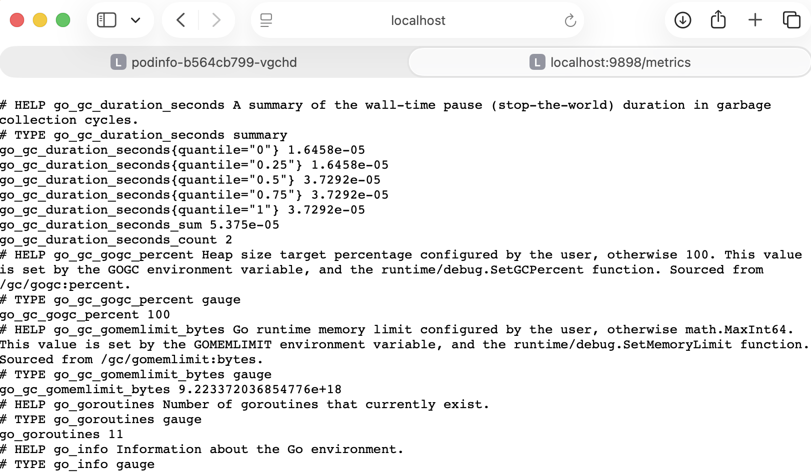

На странице `/metrics` отображались метрики приложения в формате Prometheus.

Чтобы Prometheus начал собирать метрики с `podinfo`, я создала ресурс `ServiceMonitor`.

Проверка:

```bash
kubectl get servicemonitor -n monitoring
```

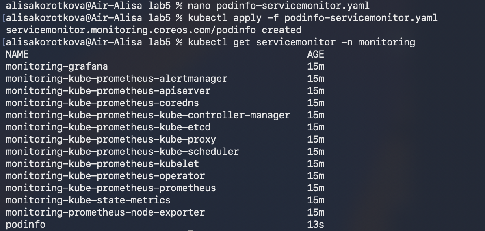

Я открыла Prometheus:

```bash
kubectl port-forward -n monitoring svc/monitoring-kube-prometheus-prometheus 9090:9090
```

В браузере перешла на:

```text
http://localhost:9090
```
Target `podinfo` находился в состоянии `UP`, значит Prometheus успешно собирал метрики.

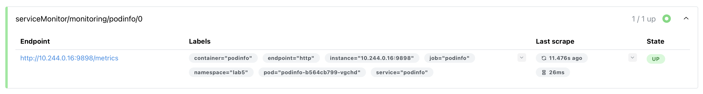

Я открыла Grafana:

```bash
kubectl port-forward -n monitoring svc/monitoring-grafana 3000:80
```

В браузере перешла на:

```text
http://localhost:3000
```
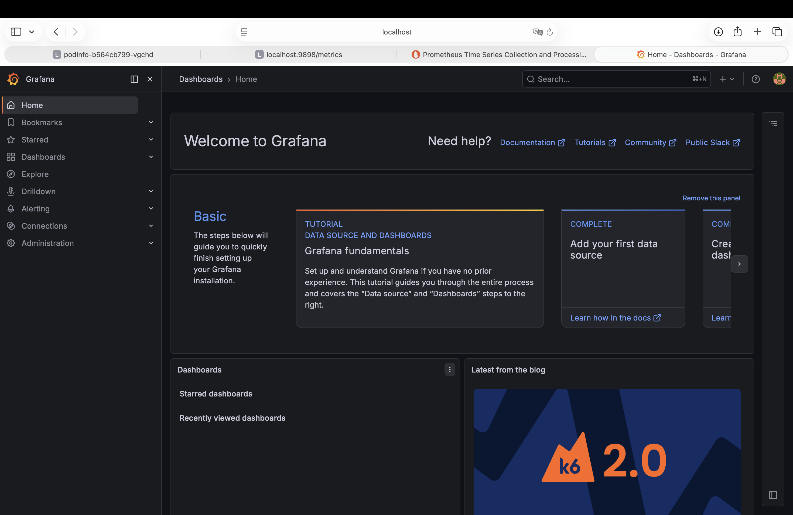

В Grafana я создала dashboard `Lab5 Kubernetes Monitoring`.

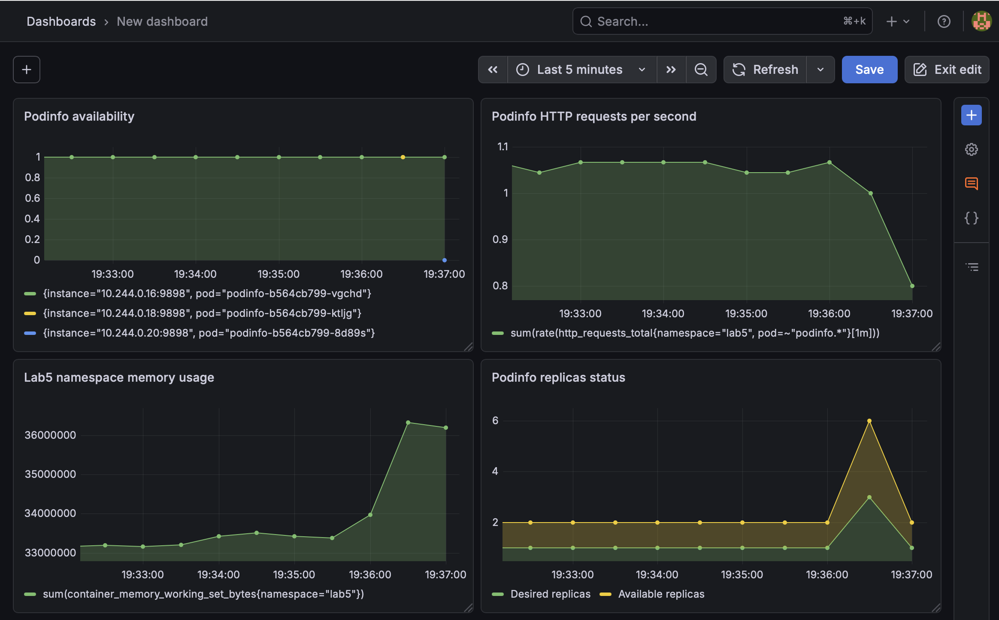

На dashboard в Grafana я добавила несколько графиков для мониторинга сервиса `podinfo`: доступность сервиса, количество HTTP-запросов в секунду, использование памяти namespace `lab5` и состояние реплик приложения. График `Podinfo availability` показывает, что сервис доступен для Prometheus. График `Podinfo HTTP requests per second` отражает нагрузку на сервис. График `Lab5 namespace memory usage` показывает использование памяти в namespace, а `Podinfo replicas status` отображает желаемое и фактически доступное количество реплик Deployment.

## Со звездочкой

В части со звездочкой я настраивала алертинг через Prometheus и Alertmanager кодом, без использования интерфейса Grafana. Сначала я пробовала настроить отправку уведомлений через Telegram. Для этого нужно было создать Telegram-бота и получить `chat_id`. Однако на ноутбуке не было VPN, поэтому этот вариант не получилось сделать

Поэтому я сделала более простой вариант : отправку алерта в локальный webhook receiver внутри Kubernetes.

```text
PrometheusRule → Prometheus → Alertmanager → webhook receiver → logs
```

Я создала webhook receiver в namespace `monitoring`.  
Он принимает HTTP-запросы от Alertmanager и выводит полученное уведомление в логи pod’а.

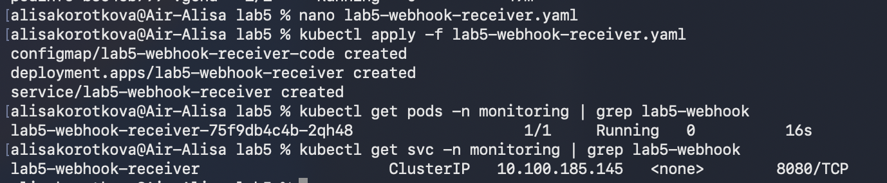

Потом я настроила Alertmanager через файл `alertmanager-webhook-values.yaml`.

В конфигурации был добавлен receiver:

```yaml
receivers:
  - name: 'lab5-webhook'
    webhook_configs:
      - url: 'http://lab5-webhook-receiver.monitoring.svc.cluster.local:8080/'
        send_resolved: true
```

Также был добавлен route для алертов с label `lab="lab5"`.

Конфигурацию я применила командой:

```bash
helm upgrade monitoring prometheus-community/kube-prometheus-stack \
  -n monitoring \
  --reuse-values \
  -f alertmanager-webhook-values.yaml
```

Дальше, я создала ресурс `PrometheusRule` с алертом `PodinfoNoAvailableReplicas`.

Алерт срабатывает, если у Deployment `podinfo` нет доступных реплик:

```yaml
expr: kube_deployment_status_replicas_available{namespace="lab5", deployment="podinfo"} < 1
```

Я открыла Prometheus и перешла в раздел Rules

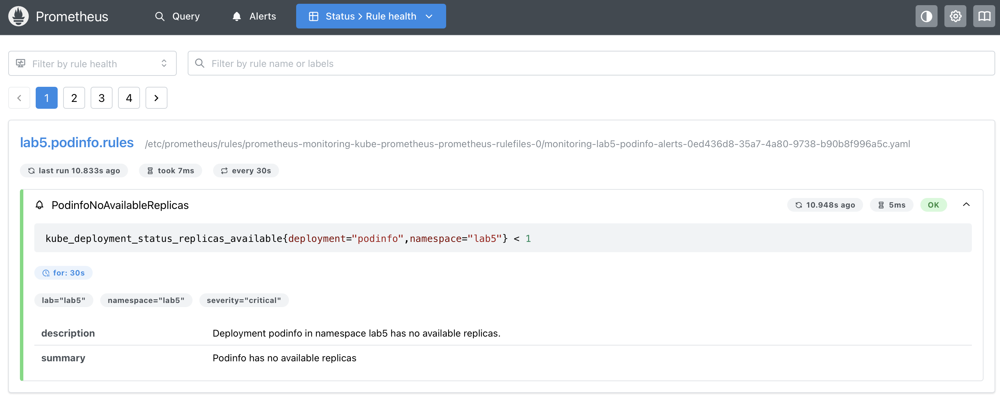

Для проверки я временно уменьшила количество реплик `podinfo` до 0:

```bash
kubectl scale deployment podinfo -n lab5 --replicas=0
```

После этого проверила Deployment:

```bash
kubectl get deployment podinfo -n lab5
```

Так как доступных реплик не осталось, алерт перешел в состояние `Firing`. В Prometheus я открыла раздел Alerts, и увидела алерт `PodinfoNoAvailableReplicas` тоже в состоянии `Firing`:

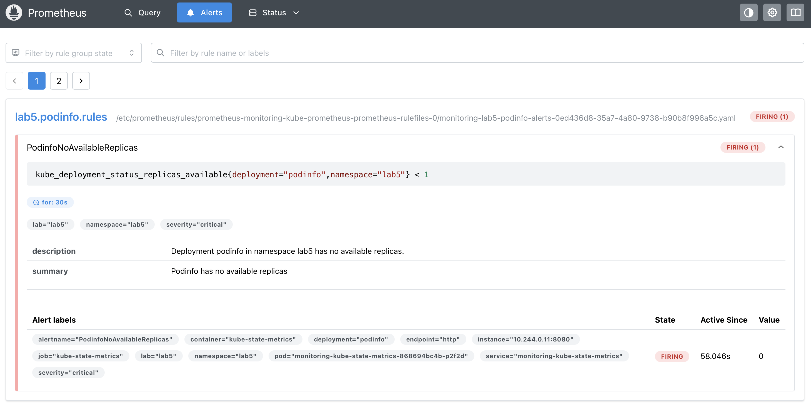

После срабатывания Alertmanager отправил уведомление в webhook receiver. И я проверила логи:

```bash
kubectl logs -n monitoring deploy/lab5-webhook-receiver
```
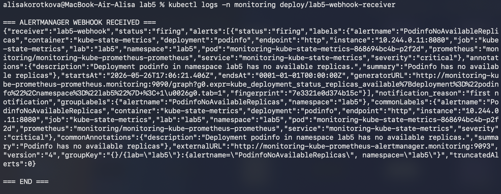

В логах было видно уведомление от Alertmanager в JSON-формате со статусом `firing`.


